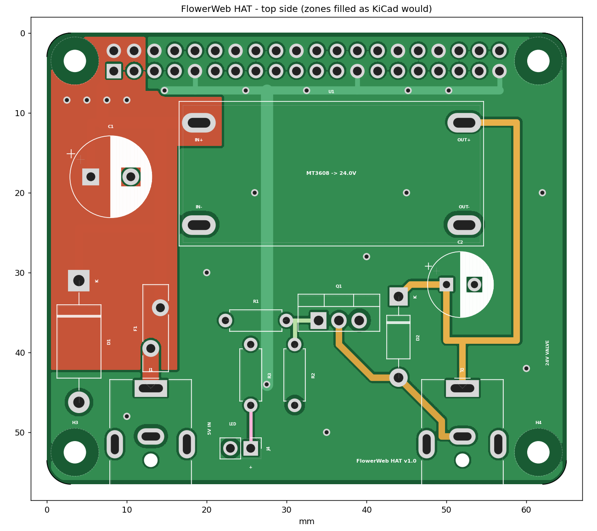

# FlowerWeb HAT (KiCad)

A Raspberry Pi HAT (65 × 56.5 mm, 2 layers) that powers the Pi from a 5 V barrel jack and switches a 24 V valve from GPIO18.

## Files

| File | What it is |
|---|---|
| `flowerweb_hat.kicad_pro` | KiCad project. Open this one |
| `flowerweb_hat.kicad_sch` | Schematic (also as `schematic.pdf`) |
| `flowerweb_hat.kicad_pcb` | Board layout |
| `flowerweb.kicad_sym`, `flowerweb.pretty/` | Project symbol and footprint library (MT3608 module footprint) |
| `BOM.csv` | Parts list |
| `preview_*.png` | Rendered previews |

Written in KiCad 7 format, so it opens in KiCad 7, 8 and 9. All other footprints come from the standard KiCad libraries.

## Circuit

- **5 V input (J1):** PJ-063AH jack (5.5 × 2.1 mm, rated 8 A) → F1 6 A resettable fuse → +5V. D1 (1.5KE6V8A TVS) clamps overvoltage and conducts if the plug is reversed, which trips F1. C1 470 µF is bulk capacitance.
- **Raspberry Pi (J3):** 2 × 20 socket on the **bottom** side. +5V goes to pins 2 and 4 (the Pi is back-powered through the header), GND to all eight ground pins.
- **24 V (U1):** MT3608 step-up module, 5 V → 24 V, with C2 100 µF / 35 V on the output.
- **Valve driver:** GPIO18 (pin 12) → R1 1 kΩ → TIP121 base. R2 10 kΩ pulls the base low so the valve stays shut while the Pi boots. The TIP121 switches the low side of the valve, and D2 (1N4007) absorbs the coil's turn-off spike.
- **Valve jack (J2):** PJ-063AH. Centre pin = **+24 V**, sleeve = **switched side**. The sleeve is *not* ground, so don't connect it to anything else.
- **Status LED (J4):** 3.3 V (pin 17) → R3 220 Ω → header pin 1 (LED +). Pin 2 = LED −. That's about 6 mA for a red or green LED. Use a lower value (e.g. 68 Ω) for blue or white.

## Before ordering

1. Open `flowerweb_hat.kicad_pro` in KiCad.
2. In the PCB editor press **B** (Fill all zones). The copper pours are saved unfilled. Every connection, GND and 5V included, is also made by traces, so there are no ratsnest lines even before filling. The pours add copper area for the 5 A current, so always fill them before ordering.
3. Run **Inspect → Design Rules Checker** and, in the schematic, **Inspect → Electrical Rules Checker**. The board was checked with independent clearance, pour and connectivity checks while it was being made, but it has not yet been opened in KiCad itself. Run both checks once before ordering.
4. Optional: **Tools → Update Footprints from Library** adds the 3D models for the 3D viewer. Afterwards, check that J3's pin 1 is still next to mounting hole H1.
5. Plot Gerbers and drill files (**File → Fabrication Outputs**). The board uses standard rules (0.2 mm clearance, 0.3 mm tracks, 0.4 mm vias) that every PCB fab supports. The MT3608 pads have **slotted holes**, which most fabs (JLCPCB, PCBWay, Aisler) make at no extra cost.

## Assembly notes

- **Set the MT3608 to 24.0 V before soldering it in.** Feed it 5 V, turn the trimmer and measure. The TIP121 drops about 1 V, so the valve sees roughly 23 V. Set 25 V if your valve needs the full 24.
- MT3608 modules differ slightly between sellers. Line up the **IN+ / IN− / OUT+ / OUT−** marks on the PCB with the ones on the module. The slotted pads allow about ±1 mm. Solder the module on with short wire legs (cut resistor leads work).
- Solder the 2 × 20 socket on the **bottom** side. Mount the HAT with M2.5 standoffs. The usual height is 11–12 mm, but measure yours with the socket plugged in.
- Raspberry Pi 5: add `usb_max_current_enable=1` to `/boot/firmware/config.txt`. Otherwise the Pi 5 limits USB current when it's powered through the GPIO header.
- The TIP121 needs no heatsink at 150 mA (about 0.15 W).
- No ID EEPROM and no camera/display cable slot are included.

## License

PolyForm Noncommercial 1.0.0. See `LICENSE.md` in the project root.
Copyright DL1BWA 2026